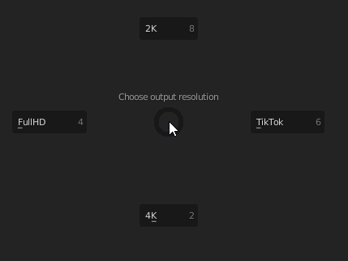
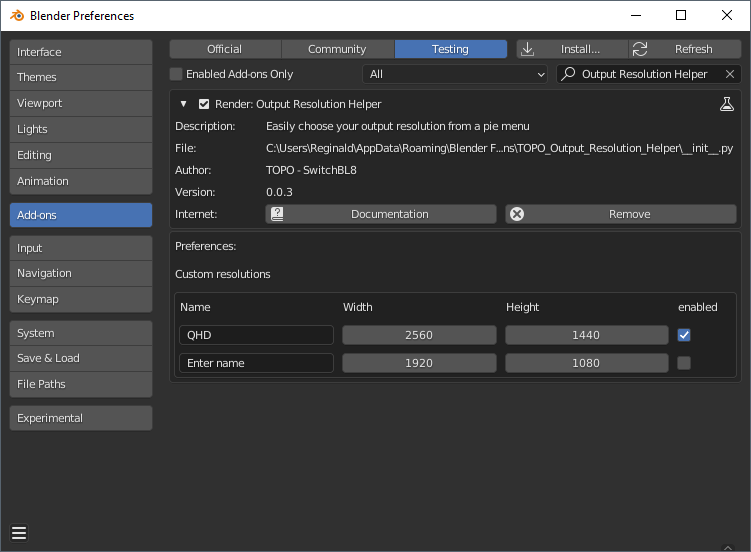

# TOPO Output Resolution Helper

Easily set your render output resolution to one of the predefined resolutions.

## Features

* Currently choose from 4 predefined resolutions

## How to Install

* Download the latest .zip
* Install the .zip as a Blender addon
* Enable the add-on (it's under the TESTING heading)

## Usage

* Press CTRL-SHIFT-R to activate the pie-menu
* Choose a resolution by moving the mouse to one of the options

## Settings

You can add your own resolutions, by opening the addon in the settings and pressing the expand arrow.

## Supported Blender versions

* Tested in 2.83, so probably 2.8x
* Tested in 2.93LTS, so probably 2.9x
* Tested in 3.0
* Tested in 3.1

## Known issues

* added custom resolutions are shown in the pie-menu in the order they were enabled in, which can differ from the order in the preferences
* When starting with custom resolutions, an extra empty line is added where it shouldn't have (since there already was an empty one)
* custom resolution dimensions is a string, not an x and y value.

